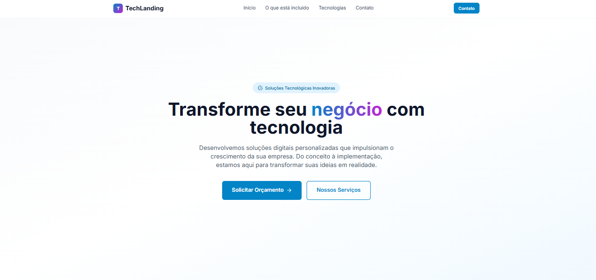
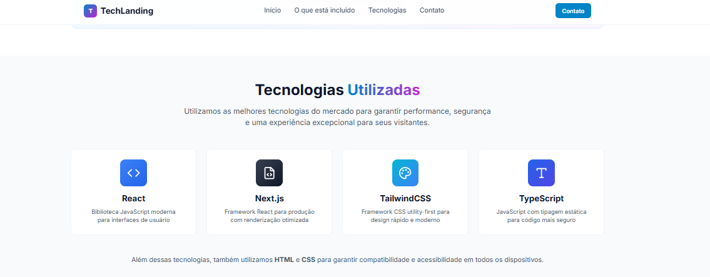
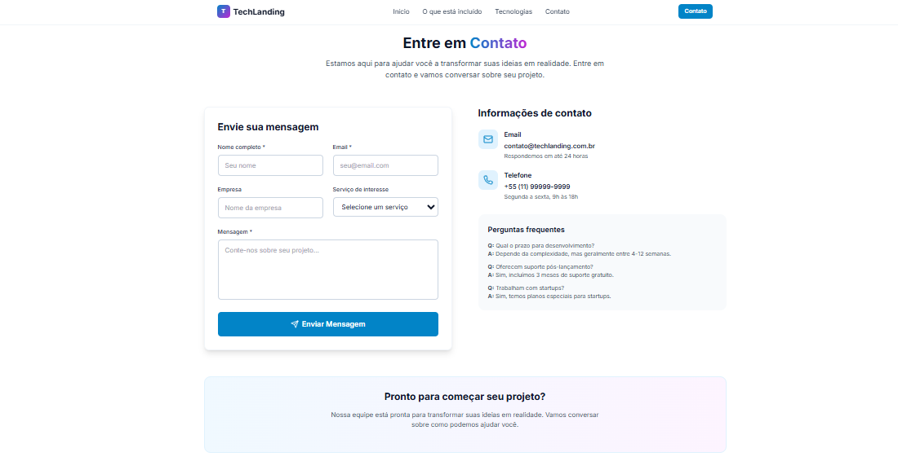

# TechLanding - Landing Page

Landing page moderna e responsiva desenvolvida para demonstrar habilidades em desenvolvimento web frontend, apresentando uma empresa fictícia de soluções tecnológicas inovadoras.

---

## 🟦 Visão Geral

Este projeto foi criado como exemplo de landing page profissional para mostrar aos clientes, demonstrando minhas habilidades em desenvolvimento web moderno, design responsivo e experiência do usuário.

- **Objetivo**: Criar uma landing page minimalista e profissional de uma empresa fictícia de tecnologia, focada em apresentar serviços de forma clara e eficiente.

- **Tipo de projeto**: Landing Page corporativa / Exemplo de portfólio.

- **Público alvo**: Clientes em busca de soluções web, empresas interessadas em desenvolvimento de landing pages profissionais.

---

## 🟦 Screenshots

As imagens abaixo representam as principais seções da landing page.



*Página inicial com apresentação da TechLanding e call-to-action principal.*


*Grid de serviços oferecidos pela empresa, com cards interativos e informações detalhadas.*



*Apresentação das tecnologias utilizadas no desenvolvimento (React, Next.js, TailwindCSS, TypeScript).*



*Formulário de contato integrado com validação e informações de contato da empresa.*


*Rodapé com informações da empresa, links de navegação e botão para voltar ao topo.*

---

## 🟦 Tecnologias Utilizadas

- **Framework**: Next.js 14 (App Router)

- **Linguagem**: TypeScript

- **Estilização**: Tailwind CSS

- **Animações**: Framer Motion

- **Outras ferramentas**: React, Lucide React (ícones), componentes reutilizáveis.

---

## 🟦 Conceitos & Foco Técnico

Este projeto foi pensado para refletir boas práticas de desenvolvimento moderno e experiência do usuário:

- **Design Responsivo**: Interface totalmente adaptável para mobile, tablet e desktop, garantindo experiência consistente em todos os dispositivos.

- **Componentização**: Cada seção (Hero, Services, Technologies, Contact) foi separada em componentes reutilizáveis dentro de `src/components/sections`, facilitando manutenção e escalabilidade.

- **Performance Otimizada**: Utiliza otimizações automáticas do Next.js 14, como code splitting, lazy loading e otimização de imagens.

- **Experiência do Usuário**: Design minimalista e profissional, com animações suaves, hierarquia visual clara e CTAs estratégicos para conversão.

- **Acessibilidade**: Contraste adequado, elementos clicáveis bem dimensionados (touch targets de pelo menos 44x44px no mobile) e navegação intuitiva.

- **SEO Otimizado**: Estrutura semântica HTML, metadados configurados e URLs amigáveis.

---

## 🟦 Como Executar o Projeto

Para rodar o projeto localmente, siga os passos abaixo:

```bash

# Clonar o repositório

git clone https://github.com/SEU-USUARIO/landing_page_project.git

# Entrar na pasta

cd landing_page_project

# Instalar dependências

npm install

# Rodar em ambiente de desenvolvimento

npm run dev

```

Após isso, a aplicação estará disponível em `http://localhost:3000`.

### Build de Produção

```bash

# Gerar build de produção

npm run build

# Iniciar servidor de produção

npm start

```

---

## 🟦 Estrutura Simplificada do Projeto

Resumo da estrutura das principais pastas:

```text

.

├── public/                # Assets públicos
│   └── ...
├── src/
│   ├── app/              # Páginas e rotas (Next.js App Router)
│   │   ├── api/          # API routes (formulário de contato)
│   │   ├── globals.css   # Estilos globais
│   │   ├── layout.tsx    # Layout principal
│   │   └── page.tsx      # Página inicial
│   ├── components/       # Componentes reutilizáveis
│   │   ├── layout/       # Header e Footer
│   │   ├── sections/     # Seções da página (Hero, Services, Technologies, Contact)
│   │   └── ui/           # Componentes base (Button, Card)
│   └── lib/              # Utilitários e helpers
│       └── utils.ts      # Função cn() para merge de classes Tailwind
└── ...

```

---

## 🟦 Funcionalidades Implementadas

- ✅ **Landing Page Moderna**: Design minimalista e profissional (1 página)

- ✅ **Design Responsivo**: Totalmente adaptável para desktop, tablet e mobile

- ✅ **Formulário de Contato**: Integrado com API route (pronto para configurar serviço de email)

- ✅ **Otimização de Performance**: Code splitting automático, lazy loading e otimização de imagens

- ✅ **Animações Suaves**: Transições elegantes com Framer Motion

- ✅ **SEO Otimizado**: Metadados configurados e estrutura semântica

- ✅ **Deploy Ready**: Pronto para deploy na Vercel ou qualquer plataforma compatível

---

## 🟦 Status do Projeto

- **Status**: ✅ Completo e funcional

- **Próximos passos** (opcionais):
  - Configurar serviço de email (Resend/SendGrid) para ativar envio do formulário
  - Adicionar analytics (Google Analytics ou similar)
  - Adicionar mais animações microinterações
  - Implementar modo claro/escuro

---

## 🟦 Sobre a Desenvolvedora

Sou Adriana Lima, desenvolvedora apaixonada por criar soluções digitais que realmente fazem a diferença. Com experiência em desenvolvimento front-end, design de interfaces e uma transição em andamento para a área de dados, busco unir funcionalidade, estética e inteligência em cada projeto.

- **Área de atuação**: Engenharia de Software, Front-End e Dados.

- **Foco**: experiências digitais intuitivas, acessíveis e visualmente agradáveis.

- **Contato**: adriana.slima0899@gmail.com

- **Localização**: Belém – PA, Brasil.

---

**Desenvolvido com Next.js 14, TypeScript e TailwindCSS.**
